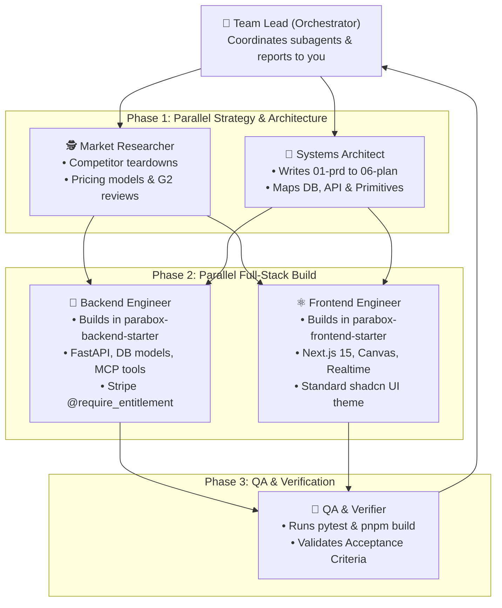

# Parabox Setup & Spec Hub

> **The Multi-Agent Autonomous Product Studio for Parabox.**  
> Powered by the **"Six Documents Before Vibe Coding"** framework and the **Parabox Method**.

---

## 👥 The Multi-Agent Product Team

When you share an idea, your AI assistant acts as a **Lead Orchestrator** that spawns a **team of specialized subagents working together in parallel**:



---

## 🚀 How It Works in 1 Step:

### You Just Say in Chat:
> *"Build a tool called **LinearEscalator** that monitors urgent Linear tickets, generates an AI fix summary, and alerts Slack."*

### The Multi-Agent Team Executes in Parallel:
1. **`market-researcher`:** Researches competitors and logs findings in `evidence/research/`.
2. **`systems-architect`:** Writes all 6 planning documents in `products/linear-escalator/`.
3. **`backend-builder`:** Scaffolds and writes the backend code in `parabox-backend-starter` (FastAPI, SQLAlchemy, Clerk Auth, Stripe, MCP tools).
4. **`frontend-builder`:** Scaffolds and writes the frontend in `parabox-frontend-starter` (Next.js 15, Canvas blocks, Realtime streaming, shadcn UI).
5. **`qa-verifier`:** Runs `pytest` and `pnpm build` to guarantee 100% passing tests.

---

## 📂 Repository Layout

```
parabox-setup/
├── products/                              # 📂 Product Portfolios
│   └── linear-escalator/                  # Reference example product
│       ├── 01-prd.md                      # 1. Product pitch & problem
│       ├── 02-trd.md                      # 2. Technical primitives mapping
│       ├── 03-app-flow.md                 # 3. Screens & user journeys
│       ├── 04-design-brief.md             # 4. Visual vibe & shadcn styling
│       ├── 05-backend-schema.md           # 5. DB models & tenant isolation
│       ├── 06-implementation-plan.md     # 6. Milestone build sequence
│       └── evidence/                      # 🧪 Market research & discovery
│           ├── research/                  # Competitor teardowns & pricing
│           └── interviews/                # Customer discovery notes
│
├── skills/                                # 🧠 Autonomous Team Skills
│   ├── idea-to-product/SKILL.md           # 🚀 Multi-agent team builder
│   ├── product-autopilot/SKILL.md         # Full autonomous runner
│   ├── interview-to-six-docs/SKILL.md     # Interactive discovery interviewer
│   ├── consistency-checker/SKILL.md       # Flags contradictions across docs
│   ├── evidence-collector/SKILL.md        # Formats research & interview notes
│   └── dispatch-to-codebase/SKILL.md      # Codebase build dispatcher
│
└── templates/                             # 📄 Master 6-Doc & Evidence Templates
```

---

## 🏛️ Connected Parabox Repositories
* 🎯 **Product Specs & Team Studio:** [`parabox-setup`](https://github.com/parabox-so/parabox-setup) *(You are here)*
* 🐍 **Backend Primitives:** [`parabox-backend-starter`](https://github.com/parabox-so/parabox-backend-starter)
* ⚛️ **Frontend Primitives:** [`parabox-frontend-starter`](https://github.com/parabox-so/parabox-frontend-starter)
