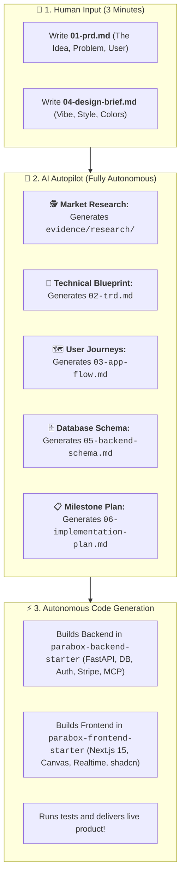

# Parabox Setup & Spec Hub

> **The Product Specification, Architecture & Autopilot Mission Control for Parabox.**  
> Powered by the **"Six Documents Before Vibe Coding"** framework and the **Parabox Method**.

---

## ⚡ The Vision: Human Idea ➔ AI Autopilot

In Parabox, **the human only spends 3 minutes writing the product idea and UI vibe**.  
The AI Agent takes over and autonomously handles **100% of the research, architecture, planning, backend coding, and frontend coding**.



---

## 🚀 How to Build a Product in 3 Steps

### 1. Scaffold a New Product Folder
```bash
pnpm new-product NAME=my-app
```
* Generates `products/my-app/` with clean templates for the 6 documents and `evidence/` subfolders.

### 2. Fill in the 2 Human Input Files
Open `products/my-app/` and spend 3 minutes filling in:
* **`01-prd.md`**: Your product concept, core problem, and 3 must-have features.
* **`04-design-brief.md`**: Your visual style, colors, and layout vibe.

### 3. Prompt Your AI Assistant to Run Autopilot
Tell any AI coding assistant (Antigravity, Cursor, Claude Code):
> *"Run `product-autopilot` on `products/my-app`."*

**The AI does everything else:**
1. Researches top competitors, pricing, and user complaints into `evidence/research/`.
2. Generates the TRD, App Flows, DB Schema, and Milestones.
3. Builds and tests the backend in `parabox-backend-starter`.
4. Builds and tests the frontend in `parabox-frontend-starter`.
5. Hands you the finished, tested product ready to run!

---

## 📂 Repository Structure

```
parabox-setup/
├── products/                              # 📂 Product Portfolios
│   ├── linear-escalator/                  # Reference example
│   │   ├── 01-prd.md                      # 👤 Human: Product pitch & problem
│   │   ├── 02-trd.md                      # 🤖 AI: Technical primitives mapping
│   │   ├── 03-app-flow.md                 # 🤖 AI: Screens & user journeys
│   │   ├── 04-design-brief.md             # 👤 Human: Visual vibe & shadcn styling
│   │   ├── 05-backend-schema.md           # 🤖 AI: DB models & tenant isolation
│   │   ├── 06-implementation-plan.md     # 🤖 AI: Milestone build sequence
│   │   └── evidence/                      # 🧪 Market research & customer discovery
│   │       ├── research/                  # Competitor teardown & market gaps
│   │       └── interviews/                # Customer discovery call transcripts
│   │
│   └── _template/                         # Copyable starter template
│
├── skills/                                # 🧠 AI Autopilot & Architect Skills
│   ├── product-autopilot/SKILL.md         # 🚀 Master end-to-end autonomous builder
│   ├── interview-to-six-docs/SKILL.md     # Interactive discovery interviewer
│   ├── consistency-checker/SKILL.md       # Flags contradictions across docs
│   ├── evidence-collector/SKILL.md        # Formats research & interview notes
│   └── dispatch-to-codebase/SKILL.md      # Codebase build dispatcher
│
└── scripts/
    ├── new_product.js                     # `pnpm new-product NAME=<name>`
    └── check_consistency.js               # `pnpm check-product NAME=<name>`
```

---

## 🏛️ Connected Parabox Repositories
* 🎯 **Product Specs & Autopilot:** [`parabox-setup`](https://github.com/parabox-so/parabox-setup) *(You are here)*
* 🐍 **Backend Primitives:** [`parabox-backend-starter`](https://github.com/parabox-so/parabox-backend-starter)
* ⚛️ **Frontend Primitives:** [`parabox-frontend-starter`](https://github.com/parabox-so/parabox-frontend-starter)
