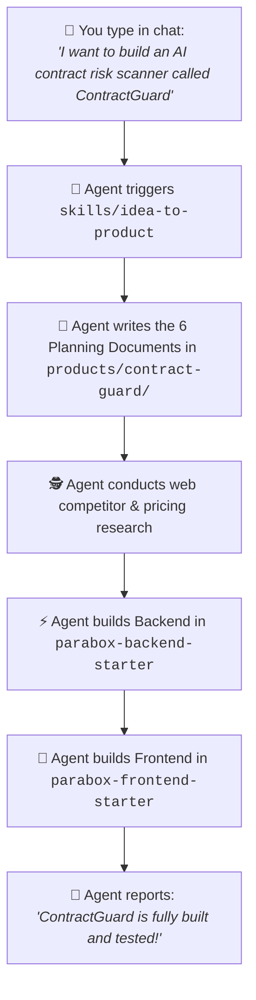

# Parabox Setup & Spec Hub

> **The Zero-Command Conversational Product Studio for Parabox.**  
> Powered by the **"Six Documents Before Vibe Coding"** framework and the **Parabox Method**.

---

## ⚡ The Vision: Just Describe Your Idea — The AI Does Everything

In Parabox, **you never have to run terminal commands or configure boilerplate**.

You simply tell your AI assistant what you want to build in plain English (or paste rough notes). The AI Agent autonomously conducts competitor research, writes the 6 architectural specifications, scaffolds the backend, scaffolds the frontend, and runs tests.



---

## 🚀 How It Works in 1 Step:

### You Just Chat with the Agent:
> *"I want to build a tool called LinearEscalator that monitors urgent Linear tickets, generates an AI fix summary, and alerts Slack."*

### The Agent Handles Everything Autonomously:
1. **Initializes the spec:** Creates `products/linear-escalator/` and drafts `01-prd.md` & `04-design-brief.md`.
2. **Researches the market:** Researches competitors and saves the teardown into `evidence/research/`.
3. **Generates technical architecture:** Writes `02-trd.md`, `03-app-flow.md`, `05-backend-schema.md`, and `06-implementation-plan.md`.
4. **Builds the Backend:** Creates `apps/linear-escalator` in `parabox-backend-starter` (FastAPI, SQLAlchemy, Clerk Auth, Stripe Tier Gating, MCP tools).
5. **Builds the Frontend:** Creates `apps/linear-escalator` in `parabox-frontend-starter` (Next.js 15, Canvas block editor, SSE stream, shadcn styling).
6. **Verifies:** Runs `pytest` and `pnpm build` to guarantee 0 errors.

---

## 📂 Repository Structure

```
parabox-setup/
├── products/                              # 📂 Product Portfolios
│   ├── linear-escalator/                  # Reference example product
│   │   ├── 01-prd.md                      # 1. Product pitch & problem
│   │   ├── 02-trd.md                      # 2. Technical primitives mapping
│   │   ├── 03-app-flow.md                 # 3. Screens & user journeys
│   │   ├── 04-design-brief.md             # 4. Visual vibe & shadcn styling
│   │   ├── 05-backend-schema.md           # 5. DB models & tenant isolation
│   │   ├── 06-implementation-plan.md     # 6. Milestone build sequence
│   │   └── evidence/                      # 🧪 Market research & customer discovery
│   │       ├── research/                  # Competitor teardowns & market gaps
│   │       └── interviews/                # Customer discovery call transcripts
│   │
│   └── _template/                         # Copyable starter template
│
├── skills/                                # 🧠 AI Autopilot & Architect Skills
│   ├── idea-to-product/SKILL.md           # 🚀 Master zero-command conversational builder
│   ├── product-autopilot/SKILL.md         # End-to-end autonomous builder
│   ├── interview-to-six-docs/SKILL.md     # Interactive discovery interviewer
│   ├── consistency-checker/SKILL.md       # Flags contradictions across docs
│   ├── evidence-collector/SKILL.md        # Formats research & interview notes
│   └── dispatch-to-codebase/SKILL.md      # Codebase build dispatcher
│
└── templates/                             # 📄 Master 6-Doc & Evidence Templates
```

---

## 🏛️ Connected Parabox Repositories
* 🎯 **Product Specs & Discovery:** [`parabox-setup`](https://github.com/parabox-so/parabox-setup) *(You are here)*
* 🐍 **Backend Primitives:** [`parabox-backend-starter`](https://github.com/parabox-so/parabox-backend-starter)
* ⚛️ **Frontend Primitives:** [`parabox-frontend-starter`](https://github.com/parabox-so/parabox-frontend-starter)
