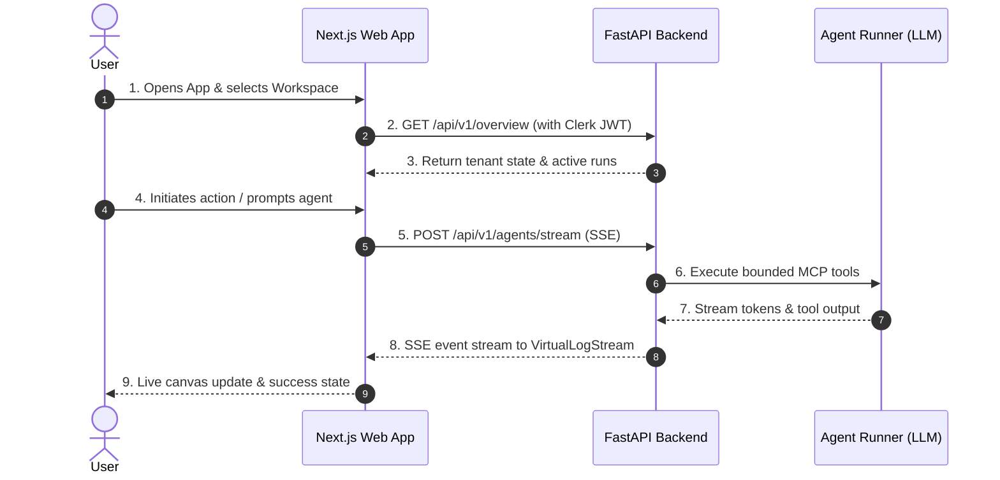

# 3. App Flow & User Journeys

> **Purpose:** Map every screen, user path, and state transition (trigger, loading, success, error, empty states) before writing frontend code.

---

## 1. Entry Points
* **Direct Web URL:** `https://app.parabox.so/[workspaceId]/[product]`
* **Invitations / Deep Links:** Email workspace invite / GitHub webhook callback
* **Onboarding / First Use:** Automatic workspace redirect after Clerk signup

---

## 2. Screen Inventory

| Screen Name | Route Path | Purpose | Required Data / Primitives |
| :--- | :--- | :--- | :--- |
| **Overview Dashboard** | `/` | Metrics, active runs, recent activity | `GET /api/v1/overview`, `@parabox/ui` |
| **Canvas / Workspace** | `/canvas` | Main interactive block editor | `@parabox/canvas`, `GET /api/v1/blocks` |
| **Agent Terminal** | `/agents` | Live SSE agent reasoning stream | `@parabox/realtime`, `/api/v1/agents/stream` |
| **Billing & Plans** | `/billing` | Stripe tier selection & usage meter | `GET /api/v1/billing/plans`, `@parabox/auth` |
| **Settings** | `/settings` | Integrations, API keys, members | `GET /api/v1/integrations` |

---

## 3. Primary User Journey

---

## 4. Alternate Journeys & Edge Cases

### A. Free Tier Locked Feature (Entitlement Guard)
* **Trigger:** User clicks a Pro-tier feature (e.g. "Run Autonomous Scan").
* **API Response:** `402 Payment Required` with `{"requiredTier": "pro"}`.
* **UI Behavior:** Interceptor catches 402, dispatches `UPGRADE_REQUIRED` to `ModalBus`, opens Stripe Checkout modal.

### B. Empty States (First Time User)
* **Screen:** Dashboard / Canvas with no data.
* **UI Behavior:** Renders `<EmptyState icon="..." title="No runs yet" description="..." action={<Button>Start First Run</Button>} />`.

### C. Offline / Reconnect State
* **Trigger:** Network disconnects during live agent run.
* **UI Behavior:** `<ConnectionStatus status="reconnecting" />` displays warning banner; SSE client reconnects with exponential backoff.
