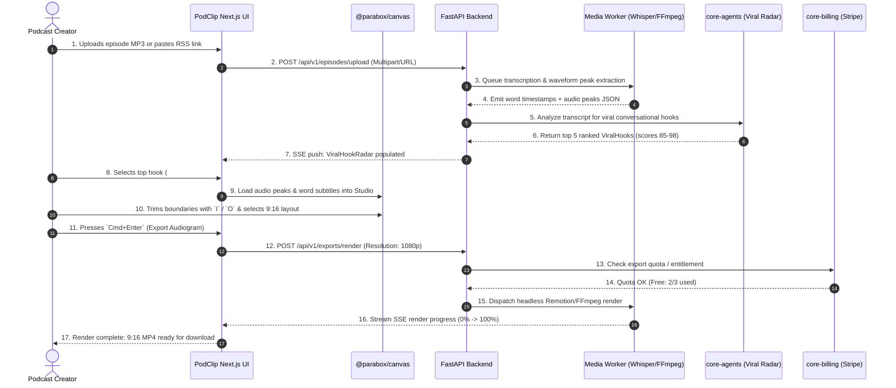

# 3. App Flow & User Journeys: PodClip AI

> **Purpose:** Map every screen, keyboard shortcut, user interaction path, and state transition (trigger, loading, success, error, empty, and upgrade states) for PodClip AI.

---

## 1. Entry Points & Routing Structure
* **Direct Web URL:** `https://app.parabox.so/[workspaceId]/podclip`
* **Episode Ingestion URL:** `https://app.parabox.so/[workspaceId]/podclip/episodes/new`
* **Studio Editor / Canvas:** `https://app.parabox.so/[workspaceId]/podclip/studio/[snippetId]`
* **Export Pantry & Library:** `https://app.parabox.so/[workspaceId]/podclip/exports`
* **Workspace Settings & Billing:** `https://app.parabox.so/[workspaceId]/podclip/settings`

---

## 2. Screen Inventory

| Screen Name | Route Path | Purpose & Primary Actions | Required Data / Parabox Primitives |
| :--- | :--- | :--- | :--- |
| **Podcast Pantry (Dashboard)** | `/podclip` | View ingested episodes, processing status, viral hooks, recent exports, and monthly quota usage meter. | `GET /api/v1/episodes`, `@parabox/ui` |
| **Episode Ingestion Hub** | `/podclip/episodes/new` | Drag-and-drop MP3/WAV upload, RSS feed importer, YouTube/Apple podcast link scraper. | `POST /api/v1/episodes/upload`, `@parabox/realtime` |
| **Viral Hook Radar** | `/podclip/episodes/[id]/hooks` | Live radar view displaying AI-extracted moments, viral scores (0-100), emotion breakdown, and one-click "Open in Studio" triggers. | `GET /api/v1/episodes/[id]/hooks`, `core-agents` |
| **Audiogram Studio Canvas** | `/podclip/studio/[snippetId]` | High-density keyboard-driven editor for waveform trimming, kinetic subtitle styling, aspect ratio toggling (9:16, 1:1, 16:9), and visual template presets. | `@parabox/canvas`, `GET /api/v1/snippets/[id]`, `@parabox/realtime` |
| **Render & Export Terminal** | `/podclip/exports` | Real-time SSE render progress queue, 1080p/4K download links, direct social sharing integrations, and export history. | `GET /api/v1/exports`, `POST /api/v1/exports/render` |
| **Billing & Studio Pantry** | `/podclip/settings` | Team asset pantry (custom fonts, logos, intro stings), Stripe plan tier management, usage meter breakdown. | `core-billing`, `GET /api/v1/billing/usage` |

---

## 3. Keyboard Shortcut Map (Cobalt High-Density Standard)

PodClip AI features a first-class keyboard navigation system designed for rapid editor throughput:

| Shortcut | Context | Action |
| :--- | :--- | :--- |
| `Space` | Studio Canvas | Toggle Audio Playback (Play / Pause) |
| `J` / `K` / `L` | Studio Canvas | Shuttle backward (2x), Pause, Shuttle forward (2x) |
| `I` | Studio Canvas | Set In-Point (Snippet Start Boundary) |
| `O` | Studio Canvas | Set Out-Point (Snippet End Boundary) |
| `[` / `]` | Studio Canvas | Nudge In-Point / Out-Point by -100ms / +100ms |
| `Cmd` + `K` / `Ctrl` + `K` | Global | Open Command Palette (Switch episodes, jump to hooks, search transcripts) |
| `1`, `2`, `3` | Studio Canvas | Switch Aspect Ratio (`1`: 9:16 Vertical, `2`: 1:1 Square, `3`: 16:9 Landscape) |
| `T` | Studio Canvas | Cycle Kinetic Subtitle Themes (Karaoke, Word-Pop, Clean Sub, Terminal Box) |
| `Cmd` + `Enter` | Studio Canvas | Dispatch Instant Video Render to Queue |
| `Esc` | Modal / Drawer | Dismiss active inspector panel or close modal |

---

## 4. Primary User Journey: Episode to Audiogram

---

## 5. Alternate Journeys & Edge States

### A. Free Tier Quota Exceeded (Entitlement Guard)
* **Trigger:** User on Free plan attempts a 4th export in a single month or selects 4K resolution / Watermark Removal.
* **API Response:** `402 Payment Required` with `{"error": "ENTITLEMENT_REQUIRED", "required_plan": "pro", "metric": "monthly_exports", "limit": 3}`.
* **UI Behavior:** Intercepted globally by `ModalBus`. Displays the Cobalt Pro Upgrade modal ($19/mo) highlighting Unlimited 4K exports and AI Viral Scoring Radar.

### B. Empty State (First Ingestion)
* **Trigger:** Workspace has zero podcast episodes uploaded.
* **UI Behavior:** Renders `<EmptyPantry />` with audio sample demo ("Try 2-minute Joe Rogan clip"), RSS quick-importer, and drag-and-drop zone with animated audio pulse.

### C. Audio Processing / Long Job State
* **Trigger:** Episode is being transcribed and scored by `core-agents`.
* **UI Behavior:** Waveform skeleton with glowing scanning beam across timeline. Telemetry pill shows: `Analyzing conversational entropy... 42% complete`.

### D. Audio Decoding / Sync Failure State
* **Trigger:** Corrupted audio container or unsupported codec upload.
* **UI Behavior:** Inline error card with actionable fix: "Audio codec unreadable. Click to auto-transcode to standard 44.1kHz MP3 with FFmpeg worker."
