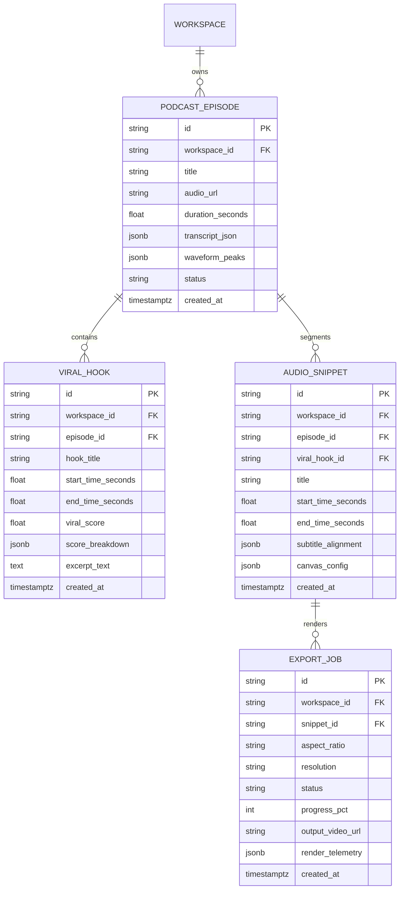

# 5. Backend Schema: PodClip AI

---

## 1. Domain Entities & Database Architecture

All entities inherit from the Parabox Base Aggregate model, enforcing strict multi-tenant isolation with a mandatory, indexed `workspace_id` column on every table.



---

## 2. Table Specifications

### Table: `app_podclip_episodes`
Stores uploaded/imported raw podcast episodes, full audio waveform peaks, and transcribed word timestamps.

| Column Name | Type | Nullable | Default | Description / Constraints |
| :--- | :--- | :--- | :--- | :--- |
| `id` | `VARCHAR(36)` | No | CUID | Primary Key |
| `workspace_id` | `VARCHAR(64)` | No | - | Tenant scope (Indexed) |
| `title` | `VARCHAR(255)` | No | - | Episode title |
| `audio_url` | `VARCHAR(1024)` | No | - | Storage URI (Cloudflare R2 / S3) |
| `duration_seconds` | `FLOAT` | No | `0.0` | Total audio length |
| `file_size_bytes` | `BIGINT` | No | `0` | File size |
| `status` | `VARCHAR(32)` | No | `'pending'` | `'pending'`, `'transcribing'`, `'ready'`, `'failed'` |
| `transcript_json` | `JSONB` | Yes | - | Word-level timestamps & speaker diarization |
| `waveform_peaks` | `JSONB` | Yes | - | Array of normalized peak values (for `@parabox/canvas`) |
| `created_at` | `TIMESTAMPTZ` | No | `now()` | Creation timestamp |
| `updated_at` | `TIMESTAMPTZ` | No | `now()` | Last update timestamp |

---

### Table: `app_podclip_viral_hooks`
Stores AI-detected conversational peaks, hook scoring metrics, and AI recommendations.

| Column Name | Type | Nullable | Default | Description / Constraints |
| :--- | :--- | :--- | :--- | :--- |
| `id` | `VARCHAR(36)` | No | CUID | Primary Key |
| `workspace_id` | `VARCHAR(64)` | No | - | Tenant scope (Indexed) |
| `episode_id` | `VARCHAR(36)` | No | - | FK to `app_podclip_episodes.id` (Indexed) |
| `hook_title` | `VARCHAR(255)` | No | - | AI-generated punchy hook headline |
| `start_time_seconds` | `FLOAT` | No | - | Hook start timestamp |
| `end_time_seconds` | `FLOAT` | No | - | Hook end timestamp |
| `viral_score` | `FLOAT` | No | `0.0` | Overall score 0.0 – 100.0 |
| `score_breakdown` | `JSONB` | No | `'{}'` | Clarity, valence, retention, coherence breakdown |
| `excerpt_text` | `TEXT` | No | - | Transcribed excerpt of the viral moment |
| `ai_rationale` | `TEXT` | Yes | - | AI explanation of why this hook will perform |
| `created_at` | `TIMESTAMPTZ` | No | `now()` | Detection timestamp |

---

### Table: `app_podclip_snippets`
Stores trimmed audio segments configured in the Studio Canvas with subtitle styling and layers.

| Column Name | Type | Nullable | Default | Description / Constraints |
| :--- | :--- | :--- | :--- | :--- |
| `id` | `VARCHAR(36)` | No | CUID | Primary Key |
| `workspace_id` | `VARCHAR(64)` | No | - | Tenant scope (Indexed) |
| `episode_id` | `VARCHAR(36)` | No | - | FK to `app_podclip_episodes.id` (Indexed) |
| `viral_hook_id` | `VARCHAR(36)` | Yes | - | Optional FK to `app_podclip_viral_hooks.id` |
| `title` | `VARCHAR(255)` | No | - | Clip title |
| `start_time_seconds` | `FLOAT` | No | - | Precision in-point |
| `end_time_seconds` | `FLOAT` | No | - | Precision out-point |
| `subtitle_alignment` | `JSONB` | Yes | - | Synchronized word timings for current slice |
| `canvas_config` | `JSONB` | No | `'{}'` | Layer stack, aspect ratio, fonts, waveform styles |
| `created_at` | `TIMESTAMPTZ` | No | `now()` | Creation timestamp |
| `updated_at` | `TIMESTAMPTZ` | No | `now()` | Last update timestamp |

---

### Table: `app_podclip_export_jobs`
Tracks video render operations, progress percentages, outputs, and billing usage metrics.

| Column Name | Type | Nullable | Default | Description / Constraints |
| :--- | :--- | :--- | :--- | :--- |
| `id` | `VARCHAR(36)` | No | CUID | Primary Key |
| `workspace_id` | `VARCHAR(64)` | No | - | Tenant scope (Indexed) |
| `snippet_id` | `VARCHAR(36)` | No | - | FK to `app_podclip_snippets.id` (Indexed) |
| `aspect_ratio` | `VARCHAR(16)` | No | `'9:16'` | `'9:16'`, `'1:1'`, `'16:9'` |
| `resolution` | `VARCHAR(16)` | No | `'1080p'` | `'720p'`, `'1080p'`, `'4k'` |
| `status` | `VARCHAR(32)` | No | `'queued'` | `'queued'`, `'rendering'`, `'completed'`, `'failed'` |
| `progress_pct` | `INTEGER` | No | `0` | Render progress (0–100) |
| `output_video_url` | `VARCHAR(1024)` | Yes | - | CDN download URL for rendered MP4 |
| `render_telemetry` | `JSONB` | Yes | - | FPS, duration, worker node, render time ms |
| `error_message` | `TEXT` | Yes | - | Failure details if status is failed |
| `created_at` | `TIMESTAMPTZ` | No | `now()` | Job dispatch timestamp |
| `completed_at` | `TIMESTAMPTZ` | Yes | - | Completion timestamp |

---

## 3. SQLAlchemy 2.0 Async Models Implementation

```python
"""
SQLAlchemy 2.0 Async models for PodClip AI.
Enforces strict multi-tenant isolation via workspace_id.
"""

from datetime import datetime
from typing import Any, Dict, List, Optional
from cuid2 import cuid_wrapper
from sqlalchemy import (
    BigInteger,
    DateTime,
    Float,
    ForeignKey,
    Integer,
    String,
    Text,
    func,
)
from sqlalchemy.dialects.postgresql import JSONB
from sqlalchemy.orm import DeclarativeBase, Mapped, mapped_column, relationship

cuid_generator = cuid_wrapper()


class Base(DeclarativeBase):
    pass


class TenantModelMixin:
    """Enforces multi-tenant workspace isolation on every domain entity."""
    workspace_id: Mapped[str] = mapped_column(
        String(64), nullable=False, index=True
    )


class PodcastEpisode(Base, TenantModelMixin):
    __tablename__ = "app_podclip_episodes"

    id: Mapped[str] = mapped_column(
        String(36), primary_key=True, default=cuid_generator
    )
    title: Mapped[str] = mapped_column(String(255), nullable=False)
    audio_url: Mapped[str] = mapped_column(String(1024), nullable=False)
    duration_seconds: Mapped[float] = mapped_column(Float, default=0.0)
    file_size_bytes: Mapped[int] = mapped_column(BigInteger, default=0)
    status: Mapped[str] = mapped_column(String(32), default="pending", index=True)
    transcript_json: Mapped[Optional[Dict[str, Any]]] = mapped_column(JSONB, nullable=True)
    waveform_peaks: Mapped[Optional[List[float]]] = mapped_column(JSONB, nullable=True)

    created_at: Mapped[datetime] = mapped_column(
        DateTime(timezone=True), server_default=func.now()
    )
    updated_at: Mapped[datetime] = mapped_column(
        DateTime(timezone=True), server_default=func.now(), onupdate=func.now()
    )

    # Relationships
    hooks: Mapped[List["ViralHook"]] = relationship(
        "ViralHook", back_populates="episode", cascade="all, delete-orphan"
    )
    snippets: Mapped[List["AudioSnippet"]] = relationship(
        "AudioSnippet", back_populates="episode", cascade="all, delete-orphan"
    )


class ViralHook(Base, TenantModelMixin):
    __tablename__ = "app_podclip_viral_hooks"

    id: Mapped[str] = mapped_column(
        String(36), primary_key=True, default=cuid_generator
    )
    episode_id: Mapped[str] = mapped_column(
        String(36), ForeignKey("app_podclip_episodes.id", ondelete="CASCADE"), nullable=False, index=True
    )
    hook_title: Mapped[str] = mapped_column(String(255), nullable=False)
    start_time_seconds: Mapped[float] = mapped_column(Float, nullable=False)
    end_time_seconds: Mapped[float] = mapped_column(Float, nullable=False)
    viral_score: Mapped[float] = mapped_column(Float, default=0.0, index=True)
    score_breakdown: Mapped[Dict[str, Any]] = mapped_column(JSONB, default=dict)
    excerpt_text: Mapped[str] = mapped_column(Text, nullable=False)
    ai_rationale: Mapped[Optional[str]] = mapped_column(Text, nullable=True)

    created_at: Mapped[datetime] = mapped_column(
        DateTime(timezone=True), server_default=func.now()
    )

    # Relationships
    episode: Mapped["PodcastEpisode"] = relationship(
        "PodcastEpisode", back_populates="hooks"
    )


class AudioSnippet(Base, TenantModelMixin):
    __tablename__ = "app_podclip_snippets"

    id: Mapped[str] = mapped_column(
        String(36), primary_key=True, default=cuid_generator
    )
    episode_id: Mapped[str] = mapped_column(
        String(36), ForeignKey("app_podclip_episodes.id", ondelete="CASCADE"), nullable=False, index=True
    )
    viral_hook_id: Mapped[Optional[str]] = mapped_column(
        String(36), ForeignKey("app_podclip_viral_hooks.id", ondelete="SET NULL"), nullable=True
    )
    title: Mapped[str] = mapped_column(String(255), nullable=False)
    start_time_seconds: Mapped[float] = mapped_column(Float, nullable=False)
    end_time_seconds: Mapped[float] = mapped_column(Float, nullable=False)
    subtitle_alignment: Mapped[Optional[Dict[str, Any]]] = mapped_column(JSONB, nullable=True)
    canvas_config: Mapped[Dict[str, Any]] = mapped_column(JSONB, default=dict)

    created_at: Mapped[datetime] = mapped_column(
        DateTime(timezone=True), server_default=func.now()
    )
    updated_at: Mapped[datetime] = mapped_column(
        DateTime(timezone=True), server_default=func.now(), onupdate=func.now()
    )

    # Relationships
    episode: Mapped["PodcastEpisode"] = relationship(
        "PodcastEpisode", back_populates="snippets"
    )
    export_jobs: Mapped[List["ExportJob"]] = relationship(
        "ExportJob", back_populates="snippet", cascade="all, delete-orphan"
    )


class ExportJob(Base, TenantModelMixin):
    __tablename__ = "app_podclip_export_jobs"

    id: Mapped[str] = mapped_column(
        String(36), primary_key=True, default=cuid_generator
    )
    snippet_id: Mapped[str] = mapped_column(
        String(36), ForeignKey("app_podclip_snippets.id", ondelete="CASCADE"), nullable=False, index=True
    )
    aspect_ratio: Mapped[str] = mapped_column(String(16), default="9:16")
    resolution: Mapped[str] = mapped_column(String(16), default="1080p")
    status: Mapped[str] = mapped_column(String(32), default="queued", index=True)
    progress_pct: Mapped[int] = mapped_column(Integer, default=0)
    output_video_url: Mapped[Optional[str]] = mapped_column(String(1024), nullable=True)
    render_telemetry: Mapped[Optional[Dict[str, Any]]] = mapped_column(JSONB, nullable=True)
    error_message: Mapped[Optional[str]] = mapped_column(Text, nullable=True)

    created_at: Mapped[datetime] = mapped_column(
        DateTime(timezone=True), server_default=func.now()
    )
    completed_at: Mapped[Optional[datetime]] = mapped_column(
        DateTime(timezone=True), nullable=True
    )

    # Relationships
    snippet: Mapped["AudioSnippet"] = relationship(
        "AudioSnippet", back_populates="export_jobs"
    )
```
