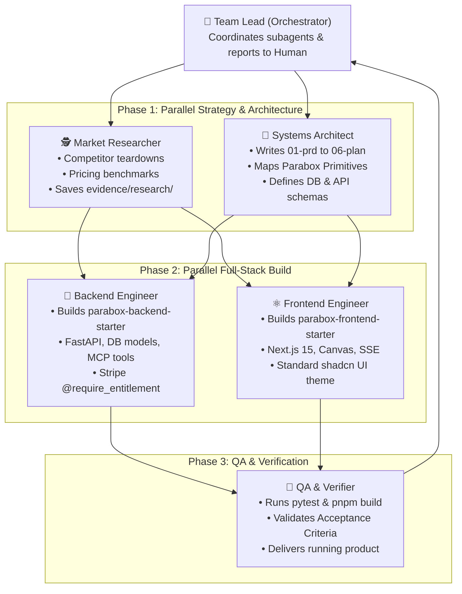

# Multi-Agent Team: Idea-to-Product Skill

Activate this skill when a user provides an idea. The main agent acts as the **Team Lead / Orchestrator** and spawns specialized subagents to work together in parallel.

---

## 👥 The 5-Agent Product Team

---

## 🤖 Subagent Roles & Team Execution Protocol

### Subagent 1: 🕵️ `market-researcher`
* **Mission:** Search the web for top 3 competitors, pricing models, and user complaints on G2/Reddit/ProductHunt.
* **Output:** Writes `products/<name>/evidence/research/competitor_analysis.md`.

### Subagent 2: 📐 `systems-architect`
* **Mission:** Ingests user idea & research to draft all 6 Planning Documents (`01-prd.md` through `06-implementation-plan.md`) in `parabox-setup/products/<name>/`.
* **Output:** Complete, unambiguous technical & database specifications.

### Subagent 3: 🐍 `backend-builder` (Runs concurrently with Frontend)
* **Mission:** Implements the backend service in `parabox-backend-starter/apps/<name>/`:
  - SQLAlchemy models extending `BaseAggregateModel` with `workspace_id`.
  - FastAPI endpoints, `@mcp_tool` declarations, and `@require_entitlement` tier guards.
  - Backend integration tests.

### Subagent 4: ⚛️ `frontend-builder` (Runs concurrently with Backend)
* **Mission:** Implements the Next.js 15 application in `parabox-frontend-starter/apps/<name>/`:
  - App layout using `@parabox/ui` `AppShell`.
  - Interactive Canvas blocks using `@parabox/canvas`.
  - Real-time streaming log terminal using `@parabox/realtime`.
  - Standard shadcn UI theme customized to user's desired aesthetic.

### Subagent 5: 🧪 `qa-verifier`
* **Mission:** Runs `pytest` in backend and `pnpm typecheck && pnpm build` in frontend.
* **Output:** Validates all user stories and acceptance criteria from `01-prd.md`.

---

## 👑 Team Lead Summary to Human
When all subagents finish, the Team Lead reports back with:
- Summary of market research findings.
- Overview of backend routes and MCP tools created.
- Overview of frontend UI views and Canvas blocks.
- One-line local launch commands.
