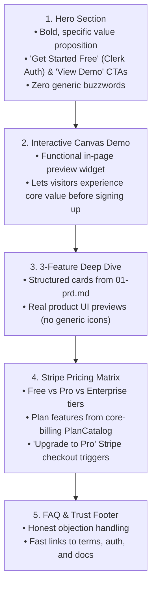

# Landing Page Generator Skill (Hallmark Powered)

Use this skill when generating or updating the public marketing homepage (`app/page.tsx` or `landing/page.tsx`) for any product in `parabox-frontend-starter`.

---

## 🎯 Objective
Transform product strategy documents (`01-prd.md`, `04-design-brief.md`) into a conversion-focused, anti-slop marketing landing page that features an interactive live demo widget, honest feature breakdowns, and real Stripe pricing cards.

---

## 🏗️ The 5-Section Conversion Blueprint

Every Parabox landing page must follow this structured, anti-slop flow:

---

## 🎨 Design & Craft Rules (Hallmark Enforced)

1. **Theme Adherence:** Read `04-design-brief.md` for the chosen Hallmark theme (e.g. `Cobalt`, `Midnight`, `Hum`, `Terminal`, `Editorial`) and use only named CSS tokens.
2. **Typography:** Upright/roman headings only (`font-style: normal`). No italicized headers.
3. **Honest Copy (No AI Slop):** 
   - Never fabricate vanity stats like *"Trusted by 50,000+ teams"* or *"+480% revenue"*.
   - Use concrete, problem-focused copy directly from `01-prd.md`.
4. **Mobile Responsiveness:** Root `overflow-x: clip`, single-column collapse on small viewports, minimum tap targets 44px.

---

## 🛠️ Step-by-Step Implementation Protocol

1. **Extract Specs:**
   - Read `products/<name>/01-prd.md` for problem statement, 3 core features, and user persona.
   - Read `products/<name>/04-design-brief.md` for theme and vibe tokens.
   - Read backend plan catalog or `02-trd.md` for Stripe tier limits.

2. **Scaffold Component in `apps/<name>/app/page.tsx`:**
   - Import `@parabox/ui` (`Button`, `Card`, `Badge`).
   - Import `@parabox/canvas` for the interactive live demo block.
   - Wire auth redirect buttons to `/sign-up` or Clerk modal.
   - Wire checkout buttons to Stripe checkout redirect.

3. **Verify with Playwright:**
   - QA agent opens `/` in headless browser to verify zero console errors, responsive layout at 375px/1280px, and working CTA buttons.
