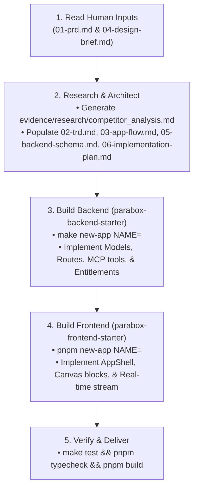

# Product Autopilot Skill

Activate this skill when a user asks to build or execute a product on autopilot (e.g. *"Run autopilot on products/podcast-clipper"*).

---

## 🤖 The 4-Stage Autopilot Workflow

---

## Stage-by-Stage Execution Instructions

### Stage 1: Ingest Human Idea & Vibe
1. Read `products/<name>/01-prd.md` to understand:
   - What problem is being solved and for whom.
   - The 2 to 4 must-have core features.
   - What is explicitly out of scope.
2. Read `products/<name>/04-design-brief.md` to understand:
   - Aesthetic (minimalist, high-density, dark mode, colors, border radius).
   - Key screen layout preferences.

### Stage 2: Autonomous Research & Planning
1. **Competitor Teardown:**
   - Analyze top competitors, their pricing models, and common user complaints from Reddit/G2/ProductHunt.
   - Write `products/<name>/evidence/research/competitor_analysis.md`.
2. **Technical Requirements (`02-trd.md`):**
   - Select required Parabox primitives (`core-auth`, `core-billing`, `core-db`, `core-agents`, `core-mcp`, `core-integrations`).
3. **App Flow (`03-app-flow.md`):**
   - Design screen inventory, primary user journey sequence diagram, and edge states (empty, loading, upgrade-gated).
4. **Backend Schema (`05-backend-schema.md`):**
   - Design SQLAlchemy tables extending `BaseAggregateModel` with mandatory `workspace_id`.
5. **Implementation Plan (`06-implementation-plan.md`):**
   - Outline 6 milestones with clear Definitions of Done.

### Stage 3: Autonomous Backend Implementation (`parabox-backend-starter`)
1. Navigate to `/Users/admin/Documents/Github/parabox-backend-starter`.
2. Scaffold the app: `make new-app NAME=<name>`.
3. Implement models in `apps/<name>/src/<name>_app/models/` using `BaseAggregateModel`.
4. Implement route handlers, MCP tools (`@mcp_tool`), and billing guards (`@require_entitlement`).
5. Run `make test` and `make lint` to verify with 0 errors.

### Stage 4: Autonomous Frontend Implementation (`parabox-frontend-starter`)
1. Navigate to `/Users/admin/Documents/Github/parabox-frontend-starter`.
2. Scaffold the app: `pnpm new-app NAME=<name>`.
3. Build pages using `@parabox/ui` `AppShell`, `@parabox/canvas`, and `@parabox/realtime`.
4. Connect `@parabox/api-client` to the backend endpoints.
5. Run `pnpm typecheck` and `pnpm build` to verify with 0 errors.

### Stage 5: Final Report to the Human
Summarize the completed product with:
- Summary of competitor research & market advantage.
- Backend routes & MCP tools created.
- Frontend pages & live canvas blocks created.
- Commands to boot and test locally (`make dev` & `pnpm dev`).
