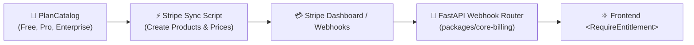

# Stripe Sync & Billing Integration Skill

Use this skill to connect the product pricing tiers defined in `01-prd.md` and `core-billing` with live Stripe Products and Prices.

---

## 🎯 Objective
Automate product and price creation in Stripe, wire `@require_entitlement` backend decorators, and connect Next.js upgrade checkout buttons.

---

## 🔄 Billing Flow



---

## 🛠️ Step-by-Step Protocol

1. **Define Plan Catalog:**
   - In `apps/<name>/src/billing.py`, define the product tiers:
     ```python
     from core_billing import PlanCatalog, PlanTier, FeatureLimit

     CATALOG = PlanCatalog(
         tiers=[
             PlanTier(id="free", name="Free Starter", price_monthly=0, features={"runs_per_month": 50}),
             PlanTier(id="pro", name="Pro Operator", price_monthly=2900, features={"runs_per_month": 1000, "mcp_access": True}),
             PlanTier(id="enterprise", name="Enterprise Scale", price_monthly=9900, features={"runs_per_month": 10000, "mcp_access": True, "custom_integrations": True}),
         ]
     )
     ```

2. **Protect Sensitive Routes:**
   - Attach `@require_entitlement("pro")` or `@meter_usage("runs_per_month")` to backend endpoints.

3. **Wire Frontend Upgrade Modal:**
   - On HTTP 402, `@parabox/api-client` triggers `ModalBus.emit("UPGRADE_REQUIRED")`.
   - UI displays `<PricingModal>` with Stripe checkout redirect.
