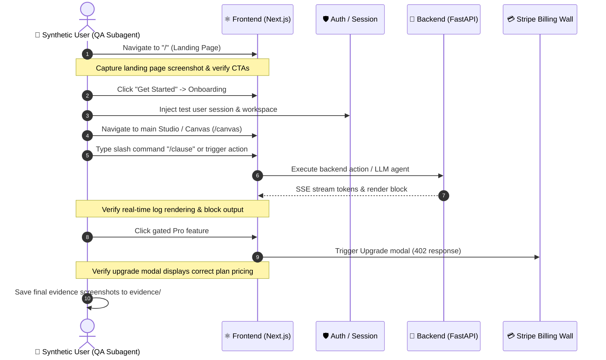

# Synthetic User Tester Skill (Playwright MCP)

Activate this skill during the **QA & Verification** phase of a product build. The QA subagent uses **Playwright MCP** to act as a synthetic human user interacting with the live application.

---

## 🎯 Verification Journey

---

## 📋 Execution Protocol

### Step 1: Headless Browser Boot & Responsive Check
1. Launch browser via Playwright MCP.
2. Navigate to `http://localhost:3000/`.
3. Test at two viewport sizes:
   - Desktop: `1280x800`
   - Mobile: `375x667` (verify no horizontal scroll bar).
4. Save screenshot to `products/<name>/evidence/screenshots/01_landing_page.png`.

### Step 2: Main User Flow Execution
1. Navigate to `/canvas` or main product route.
2. Verify all UI components render without JavaScript errors or React hydration warnings.
3. Trigger the primary action (e.g. submit a prompt, add a canvas block, run an analysis).
4. Verify backend response renders in the UI.
5. Save screenshot to `products/<name>/evidence/screenshots/02_core_action.png`.

### Step 3: Entitlement & Paywall Check
1. Click a feature designated as `PRO` or `ENTERPRISE` in `01-prd.md`.
2. Confirm the UI shows the `<RequireEntitlement>` upgrade modal instead of crashing.
3. Save screenshot to `products/<name>/evidence/screenshots/03_upgrade_gate.png`.

### Step 4: Verification Report
Emit a summary in `products/<name>/evidence/qa_verification_report.md` with:
- Total assertions passed / failed.
- Page load latency metrics.
- Console error log (must be 0 errors).
- Embedded screenshots.
