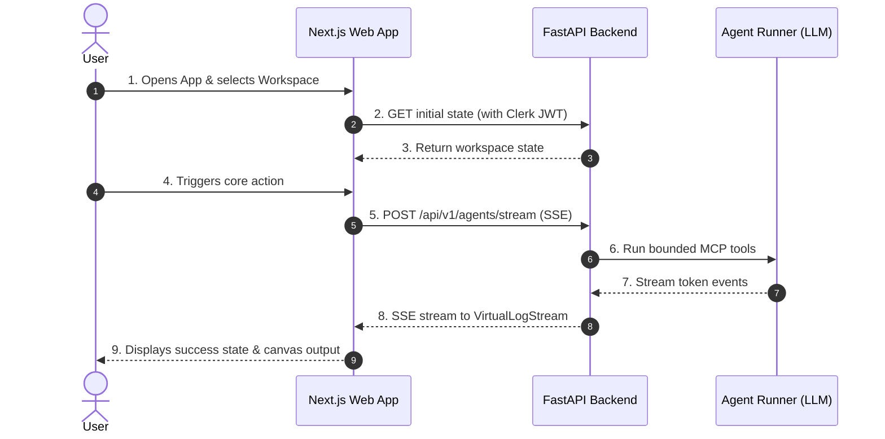

# 3. App Flow & User Journeys

> 🤖 **AI-GENERATED ON AUTOPILOT:** The AI Agent automatically generates the screen inventory, primary journey, and edge states based on `01-prd.md` and `04-design-brief.md`.

---

## 1. Screen Inventory

| Screen Name | Route Path | Purpose | Key Components & Primitives |
| :--- | :--- | :--- | :--- |
| **Overview Dashboard** | `/` | Metrics, active runs, quick launch | `@parabox/ui` AppShell, `Card`, `Button` |
| **Main Product Studio** | `/studio` | Core user workflow & canvas blocks | `@parabox/canvas`, `@parabox/realtime` |
| **Billing & Plans** | `/billing` | Stripe plan upgrade modal & usage | `@parabox/auth` `<RequireEntitlement>` |

---

## 2. Primary User Journey

---

## 3. Edge States & Handling
* **Empty State:** Clean empty illustration with primary CTA button.
* **Locked Feature:** Catches HTTP 402, triggers `ModalBus` Stripe upgrade dialog.
* **Loading State:** Skeletons and live terminal progress.
